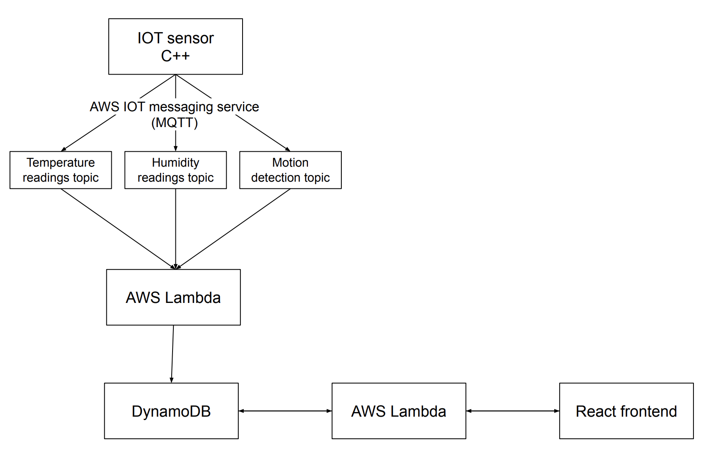

# Sensor Dashboard

A React dashboard to view temperature, humidity and motion detection data produced by the [ESP32 sensor module project](https://github.com/jackrehaag/esp32_sensor_module).

## Getting started

### Technical overview

This diagram shows the services that produce and transport the data used in this dashboard.

The code for the following services can be found in these locations:

- [IOT sensor](https://github.com/jackrehaag/esp32_sensor_module)
- [AWS Lambda (MQTT -> DynamoDB)](https://github.com/jackrehaag/sensor-dashboard/tree/master/lambdas/sensor_readings_to_dynamodb)
- [AWS Lambda (DynamoDB -> dashboard)](https://github.com/jackrehaag/sensor-dashboard/tree/master/lambdas/dynamodb_requests)

### Environment variables

The following environment variables must be set for this app to work.

| Variable                        | Description                                              |
| ------------------------------- | -------------------------------------------------------- |
| REACT_APP_READINGS_API          | Host of the readings API, ex. `http://your-api-host.com` |
| REACT_APP_READINGS_API_ENDPOINT | Endpoint for the readings API, ex `/get-data`            |

### Running locally

`npm start`
